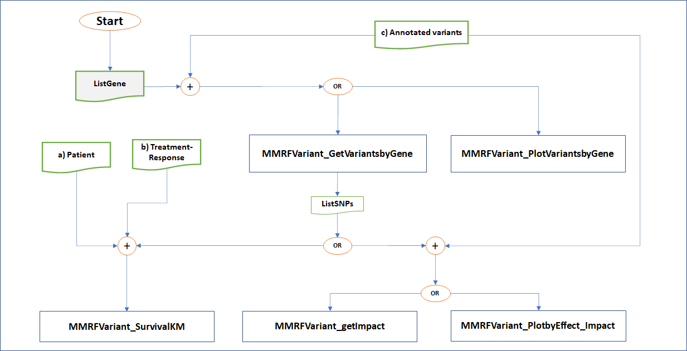

<!-- README.md is generated from README.Rmd. Please edit that file -->

```{r, include = FALSE}
knitr::opts_chunk$set(
  collapse = TRUE,
  comment = "#>",
  fig.path = "man/figures/README-",
  out.width = "100%"
)
```


# MMRFVariant Package

<!-- badges: start -->
<!-- badges: end -->

<p align="justify">
MMRFVariant is a R package that performs an integrative analysis of the variants likely involved in the Multiple Myeloma (MM) in order to support the prioritization process of them. MMRFVariant deals with the clinical and genomic data retrieved from MMRF-CoMMpass study that are stored at [MMRF-Commpass Researcher Gateway (RG)](https://research.themmrf.org/). <br>

MMRFVariant requires a local copy of the MMRF-CoMMpass datasets that can be downloaded from the MMRF-RG by the registered users. Once the datasets have been downloaded, they can be saved locally in a tab-delimited text file format for importing them into the R environment as a dataframe for the further downstream analysis.

</p>


## Installation

Once R (version > “4.0”) has been started, you can install the released version of MMRFVariantPackage from GitHub with

``` r
devtools::install_github("marziasettino/MMRFVariantPackage", build_vignettes = TRUE)
library(MMRFVariantPackage)
```

## Required libraries


```{r eval=FALSE, message=FALSE, warning=FALSE}
library(dplyr)
library(DT)
library(ggplot2)
library(stringr)
library(ggpubr)
```

### Use-case diagram of MMRFVariant

<div class="panel panel-info">
<div class="panel-heading">
The use-case diagram represents the high-level functionalities of MMRFVariant. "ListGene" is the list of genes of which to explore and analyze the occurring variants. <br>
"ListSNPs" is the set of variants occurring in the "ListGene".


</div>
<div class="panel-body">
</div>
</div>


```{r figurename5, echo=FALSE, fig.cap="Use-case diagram that represents the high-level functionalities of MMRFVariant", out.width = '90%'}

```


## Vignettes
A list of all currently integrated vignettes can be obtained through:


```{r eval=FALSE, message=FALSE, warning=FALSE}
vignette(package="MMRFVariant")
```
The best way to view vignettes is in your web browser:


```{r eval=FALSE, message=FALSE, warning=FALSE}
devtools::load_all(".")
browseVignettes("MMRFVariant")
```

Get the list of the example data sets

```{r eval=FALSE, message=FALSE, warning=FALSE}
data(package = "MMRFVariant")
```

