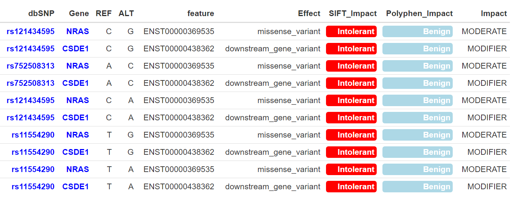

```{r, include = FALSE}
knitr::opts_chunk$set(
  collapse = TRUE,
  warning=FALSE, 
  message=FALSE,
  comment = "#>"
)
```

```{r setup}
library(MMRFVariant)
library(dplyr)
library(DT)
library(ggplot2)
library(stringr)
library(ggpubr)
library(survminer)
library(survival)
library(formattable)
```


```{r, echo = FALSE,hide=TRUE, message=FALSE,warning=FALSE}
devtools::load_all(".")
```

```{r message=FALSE, warning=FALSE, include=FALSE}
library(dplyr)
library(DT)
library(ggplot2)
library(stringr)
library(ggpubr)
```

<!--# <b>Set the list of gene <ListGene> to analyze </b>-->
MMRFVariant provides five functions that perform a graphical representation of the results that is useful for a their more intuitive interpretation. Here we preset a case study


### Case Study - Integrative Analysis of Variants in MM

The six gene-signature including the genes KRAS, NRAS, TP53, FAM46C, DIS3, BRAF have a high recurrence rate and may play important roles in the pathogenesis, progression and prognosis of MM. 
This case study shows how MMRFVariant performs the integrative analysis of variants in that six gene-signature to prioritize pathogenic variants involved in the MM.
For a more intuitive interpretation of the results, MMRFVariant provides a graphical or tabular representation of the outputs.
The Figure below shows the workflow that describes graphically step by step the procedure carried out to perform this case of study. </br>

```{r figurename="workflow", echo=FALSE, fig.cap="Fig. 1 The workflow describes graphically step by step the procedure carried out to perform this case of study ", out.width = '99%'}
knitr::include_graphics("imgs/workflow.png")
```


### <b> Set the list of gene "ListGene" to analyze </b>
First of all, the list of gene "ListGene" to analyze is set.

```{r results = 'hide', message=FALSE, warning=FALSE, eval = F}
ListGene<-c("KRAS", "NRAS","TP53","FAM46C","DIS3","BRAF")


```
### <b> Step 1 -  to draw the Heatmap of the N# of variants occurring in "ListGene" </b>


```{r results = 'hide', message=FALSE, warning=FALSE, eval = F}

variants.plot<-MMRFVariant_PlotVariantsbyGene(variant.ann,ListGene,height=20,
                                              width=30,topN=50,
                                              filenm="PlotVariantsbyGene_heatmap")
variant.impact_effect

```


```{r figurename="PlotVariantsbyGene_heatmap", echo=FALSE, fig.cap="Heatmap of the N# of variants occurrence in ListGene", out.width = '90%'}
knitr::include_graphics("imgs/PlotVariantsbyGene_heatmap.png")
```

### <b> Step 2 - Identify the SNPs </b>
We identify the SNPs in genes of "ListGene".

```{r results = 'hide', message=FALSE, warning=FALSE, eval = F}

ListSNPs.bycount<-MMRFVariant_GetVariantsbyGene(variant.ann,ListGene)
ListSNPs<-ListSNPs.bycount$dbSNP


```
```{r  echo=TRUE, message=FALSE, warning=FALSE}

ListSNPs.bycount

```


### <b>Step 3 -  Perform the impact table and draw the Impact-Effect plot of each SNP in "ListGene" </b>
We perform the impact table of each SNP in "ListGene" (i.e. ListSNPs). The impacts values are ordered by ascending SIFT and descending Poliphen-2 scores.

```{r results = 'hide', message=FALSE, warning=FALSE, eval = F}
impact.table<-MMRFVariant_GetImpact(variant.ann,ListSNPs)

   #For semplification purposes, we visualize a subset of columns and rows
   impact.table.sub<-dplyr::select(impact.table,dbSNP,
                                   Gene,REF,
                                   ALT,feature,Effect,
                                   SIFT_Impact,Polyphen_Impact,Impact)

    head(unique(impact.table.sub),10)
```   
    

```{r figurename="ImpactTable", echo=FALSE, fig.cap="Impact table of each SNP in ListGene", out.width = '90%'}
knitr::include_graphics("imgs/ImpactTable.png")
```


```{r results = 'hide', message=FALSE, warning=FALSE, eval = F}

plot.impact.effect<-MMRFVariant_PlotbyEffectImpact(variant.ann,ListSNPs,topN=50,height=30, 
                                              width=15, filenm="PlotbyEffectImpact")

plot.impact.effect
```   

```{r figurename="PlotEffectbyImpact", echo=FALSE, fig.cap="Impact-Effect table of each SNP in ListGene", out.width = '90%'}
knitr::include_graphics("imgs/PlotEffectbyImpact.png")
```


### <b>Step 4 -  Focus on NRAS gene </b>

Among the genes included in the "ListGene", we focus on NRAS gene
that has a high number of variants occurrence with respect to other genes in the "ListGene" (see "ListSNPs.bycount")
and it is known that NRAS variants occur in half of MM patients and confer a poor prognosis.  

```{r results = 'hide', message=FALSE, warning=FALSE, eval = F}
ListSNPs.bycount_NRAS<-MMRFVariant_GetVariantsbyGene(variant.ann,"NRAS")
ListSNPs_NRAS<-ListSNPs.bycount_NRAS$dbSNP

impact.table_NRAS<-MMRFVariant_GetImpact(variant.ann,ListSNPs_NRAS)

 #For semplification purposes, we visualize a subset of columns and rows
   impact.table.sub_NRAS<-dplyr::select(impact.table_NRAS,dbSNP,
                                        Gene,REF,ALT,feature,Effect,                                                              SIFT_Impact,Polyphen_Impact,Impact)

    head(unique(impact.table.sub_NRAS),10)


``` 

```{r figurename="ImpactTable_NRAS", echo=FALSE, fig.cap="Impact table of each SNP in NRAS gene", out.width = '90%'}


``` 


