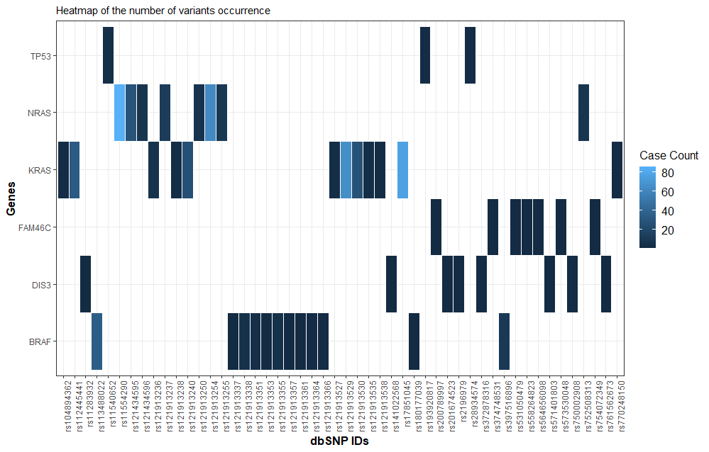

```{r, include = FALSE}
knitr::opts_chunk$set(
  collapse = TRUE,
  warning=FALSE, 
  message=FALSE,
  comment = "#>"
)
```

```{r setup}
library(MMRFVariant)
library(dplyr)
library(DT)
library(ggplot2)
library(stringr)
library(ggpubr)
library(survminer)
library(survival)
library(formattable)
```


```{r, echo = FALSE,hide=TRUE, message=FALSE,warning=FALSE}
devtools::load_all(".")
```

```{r message=FALSE, warning=FALSE, include=FALSE}
library(dplyr)
library(DT)
library(ggplot2)
library(stringr)
library(ggpubr)
```

<!--# <b>Set the list of gene <ListGene> to analyze </b>-->
MMRFVariant provides five functions that perform a graphical representation of the results that is useful for a their more intuitive interpretation. Here we preset a case study


### Case Study - Integrative Analysis of Variants in MM

The six gene-signature including the genes KRAS, NRAS, TP53, FAM46C, DIS3, BRAF have a high recurrence rate and may play important roles in the pathogenesis, progression and prognosis of MM. 
This case study shows how MMRFVariant performs the integrative analysis of variants in that six gene-signature to prioritize pathogenic variants involved in the MM.
For a more intuitive interpretation of the results, MMRFVariant provides a graphical or tabular representation of the outputs.
The Figure below shows the workflow that describes graphically step by step the procedure carried out to perform this case of study. </br>

```{r figurename="workflow", echo=FALSE, fig.cap="workflow that describes graphically step by step the procedure carried out to perform this case of study ", out.width = '99%'}

```


### <b> Set the list of gene <ListGene> to analyze </b>

```{r results = 'hide', message=FALSE, warning=FALSE, eval = F}
ListGene<-c("KRAS", "NRAS","TP53","FAM46C","DIS3","BRAF")


```
### <b> Step 1 -  to draw the Heatmap of the N# of variants occurrence in "ListGene" </b>


```{r results = 'hide', message=FALSE, warning=FALSE, eval = F}

variants.plot<-MMRFVariant_PlotVariantsbyGene(variant.ann,ListGene,height=20, width=30,topN=50,
                                              filenm="PlotVariantsbyGene_heatmap")
variant.impact_effect

```


```{r figurename="PlotVariantsbyGene_heatmap", echo=FALSE, fig.cap="Heatmap of the N# of variants occurrence in ListGene", out.width = '90%'}

```

### <b> Step 2 - Get the SNPs found in genes of <ListGene> </b>
```{r results = 'hide', message=FALSE, warning=FALSE, eval = F}

ListSNPs.bycount<-MMRFVariant_GetVariantsbyGene(variant.ann,ListGene)
ListSNPs<-ListSNPs.bycount$dbSNP

```


### <b>Step 3 -  Perform the impact table of each SNP in "GeneList" (ordered by ascending SIFT and descending Poliphen) </b>
```{r results = 'hide', message=FALSE, warning=FALSE, eval = F}
impact.table<-MMRFVariant_getImpact(variant.ann,ListSNPs)

   #For semplification purposes, we visualize a subset of columns and rows
   impact.table.sub<-dplyr::select(impact.table,dbSNP,Gene,REF,ALT,feature,Effect,
                     SIFT_Impact,Polyphen_Impact,Impact)

    head(unique(impact.table.sub),10)
```   
    

```{r figurename="ImpactTable", echo=FALSE, fig.cap="Impact table of each SNP in GeneList", out.width = '90%'}

```


### <b> step 4 - Plot the Impact-Effect of SNPs obtained from step 3 </b>
```{r results = 'hide', message=FALSE, warning=FALSE, eval = F}

plot.impact.effect<-MMRFVariant_PlotbyEffect_Impact(variant.ann,ListSNPs,topN=50,height=30, 
                                              width=15, filenm="PlotbyEffectImpact")

plot.impact.effect
```   

```{r figurename="PlotEffectbyImpact", echo=FALSE, fig.cap="Impact table of each SNP in GeneList", out.width = '90%'}

```


